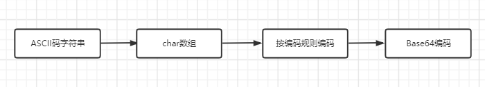

# Base64解码和编码

## 1. Base64编码简单介绍

1. **简介**：**Base64**是一种基于64个可打印字符来表示二进制数据的表示方法。由于$log_2^{64} = 6$，所以每6个位元为一个单元，对应某个可打印字符。3个字节相当于24个位元，对应于4个Base64单元，即3个字节可由4个可打印字符来表示。在Base64中的可打印字符包括字母`A-Z`、`a-z`、数字`0-9`，这样共有62个字符，外加`+`、`/`。

2. **编码表**：

    | 索引 | 编码 | 索引 | 编码 | 索引 | 编码 | 索引 | 编码 |
    | ---- | ---- | ---- | ---- | ---- | ---- | ---- | ---- |
    | 0    | A    | 16   | Q    | 32   | g    | 48   | w    |
    | 1    | B    | 17   | R    | 33   | h    | 49   | x    |
    | 2    | C    | 18   | S    | 34   | i    | 50   | y    |
    | 3    | D    | 19   | T    | 35   | j    | 51   | z    |
    | 4    | E    | 20   | U    | 36   | k    | 52   | 0    |
    | 5    | F    | 21   | V    | 37   | l    | 53   | 1    |
    | 6    | G    | 22   | W    | 38   | m    | 54   | 2    |
    | 7    | H    | 23   | X    | 39   | n    | 55   | 3    |
    | 8    | I    | 24   | Y    | 40   | o    | 56   | 4    |
    | 9    | J    | 25   | Z    | 41   | p    | 57   | 5    |
    | 10   | K    | 26   | a    | 42   | q    | 58   | 6    |
    | 11   | L    | 27   | b    | 46   | r    | 59   | 7    |
    | 12   | M    | 28   | c    | 44   | s    | 60   | 8    |
    | 13   | N    | 29   | d    | 45   | t    | 61   | 9    |
    | 14   | O    | 30   | e    | 46   | u    | 62   | +    |
    | 15   | P    | 31   | f    | 47   | v    | 63   | /    |

## 2. Base64编码原理和实现框架

1. Base64编码原理：

    1. 将每三个字节作为一组，一共是 24 个二进制位。
    2. 将这 24 个二进制位分为四组，每个组有 6 个二进制位。
    3. 在每组前面加两个 00，扩展成 32 个二进制位，即四个字节。
    4. 根据Base64编码表，得到扩展后的每个字节的对应符号，这就是 Base64 的编码值

2. 如果字节数不足三，处理如下：

    * 两个字节：将这两个字节的共 16 个二进制位按照上面的规则转成三组，最后一组除了前面加两个 0 以外，后面再加 2 个 0。这 样得到一个三位的 Base64 编码，再在末尾补上 1 个`=`号。
    * 一个字节：将这一个字节的 8 个二进制位，按照上面的规则转成两组，最后一组除了前面加两个 0 以外，后面再加 4 个 0。这 样得到一个两位的 Base64 编码，再在末尾补上 2 个`=`号。

3. Base64编码实现流程：

    * 

## 3. Base64解码原理和实现框架

1. Base64解码原理：编码的逆过程